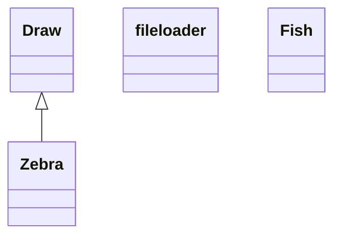

# Initial structure for the project

## CLI Folder check

This module should do a check of the .s2p-files in a given folder, decide what options are available for this particular data.

## CLI Circuit builder

- Input: folder with S-parameter files (two-port-networks) in Touchstone format (.s2p-files)
- Output: a file containing the proper signal path between the different networks.
- A function should somehow guess the device type of each of the networks. Maybe store them in the output file.
- The tool should be a CLI-tool which goes through each of the .s2p-files and adds them one by one to a simple ascii-character-diagram in the terminal.
- The first drawing of the diagram should be a single node
- Next you will be asked to chose the file with the left-most network/component and then work your way to the right-most component of the device. Selecting the correct files on the way
- There should afterwards be an option to swap, delete or insert network-files in the circuit by numbered nodes on the diagram, which can the be selected with the keyboard

## Device Type Guesser

This module should be able to give a qualified guess on which kind of component a given touchstone file is a measurement of.

- Input: S-parameter file, maybe also a circuit from the circuit builder above
- Output: A simple dictionary containing the network name/filename as keys and the device type (Amplifier, Filter, Mixer etc. ) as values.
- Output2: The function should also create a log-file containg the a measure of the quality of each guess.
- Supervised-Machine Learning might be a choice here.
-
